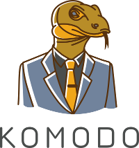

# Painless way to build software 

  

**Komodo** - is a framework aims to simplify development of modern web applications.

Main components:

* Dependency Injection;
* Modular system;
* Configuration;
* Logging;
* Testing;
* Number of ready to use integrations.

[Getting started](./docs/getting-started.adoc)

## Code Style

We use official [Kotlin Style Guide](https://kotlinlang.org/docs/reference/coding-conventions.html).

## Contributing

I will happily accept your pull request if it:

- has tests;
- solve particular, documented and agreed problem (issue);
- does not break backwards compatibility (until it discussed in issue).

See [Collective Code Construction Contract](./Collective%20Code%20Construction%20Contract.md) for details.

## Licence

Komodo is **Free Software** released under the **[LGPL-3.0-or-later](https://github.com/Heapy/komodo/blob/master/LICENSE)** license.

